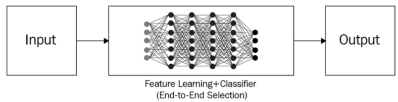

# Artificial Neural Networks - Notes

## Concepts
### Universal Approximation Theorem
We can always find a large enough neural network architecture with the right set of weights that can exactly predict any output for any given input.

### Traditional ML vs Deep Learning Workflow

