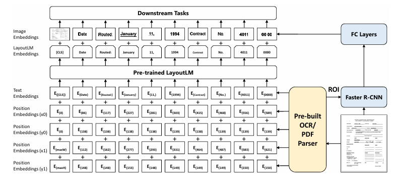

# CV + NLP

## Concepts
### Multimodality
#### Challenges
1. **Representation**: explores techniques to effectively summarize multimodal data, capturing the intricate connections among individual modality elements
2. **Alignment**: focuses on identifying connections and interactions across all elements
3. One modality may dominate others
4. Additional modalities can introduce noise
5. Full coverage over all modalities is not guaranteed
6. Different modalities can have complicated relationships

#### Paradigm
1. Pre-training the model with extensive training data
2. Fine-tuning the pre-trained model with task-specific data
3. Utilizing the trained model for downstream tasks such as classification

### Visual Language Models (VLMs)
#### Mechanism
Given image-text pairs:
- Extract image and text features using text and image encoders
- Learn the vision-language correlation with certain pre-training objectives (divided into 3 groups):
    1. **Contrastive** objectives: to learn discriminative representations by pulling paired samples close and pushing others faraway in the embedding space 
    2. **Generative** objectives: to learn semantic features by training networks to generate image/text data
    3. **Alignment** objectives: align the image-text pair via global image-text matching or local region-word matching on embedding space
- With the learned vision-language correlation, VLMs can be evaluated on unseen data in a zero-shot manner

#### Strategies
- Translating images into embedding features that can be jointly trained with token embeddings
    - Images are divided into multiple smaller patches and each patch is treated as one token in the input sequence
    - e.g.  VisualBERT, SimVLM
- Learning good image embeddings that can work as a prefix for a frozen, pre-trained language model
    - Don't change the language model parameters, instead learn an embedding space for images, such that it is compatible with the language model
    - e.g. Frozen, ClipCap
- Using a specially designed cross-attention mechanism to fuse visual information into layers of the language model
    - e.g. VisualGPT
- Combine vision and language models without any training
    - e.g. MAGiC

## Models
### CLIP
*Learning Transferable Visual Models From Natural Language Supervision*

- Utilizes an image-text contrastive object, to capture rich vision-language correspondence knowledge, enabling zero-shot predictions
- Outperformed ImageNet models on out-of-distribution tasks

### Tr-OCR
*TrOCR: Transformer-based Optical Character Recognition with Pre-trained Models*

**Workflow**:
1. We take an input and resize it to a fixed height and width.
2. Then, we divide the image into a set of patches.
3. We then flatten the patches and fetch embeddings corresponding to each patch.
4. We combine the patch embeddings with position embeddings and pass them through an encoder.
5. The key and value vectors of the encoder are fed into the crossattention of the decoder to fetch the outputs in the final layer.

### LayoutLM
*LayoutLM: Pre-training of Text and Layout for Document Image Understanding*

**Document layout analysis**: build a single model that is able to assign a value corresponding to each text within the document image.

**Workflow**:
1. We take an image of the document and extract the various words and
their bounding-box coordinates (x0, x1, y0, and y1) – this is doneusing tools that help in OCR where they provide not only the text but also the bounding box in which the text is present in the document.
2. We take the position embeddings corresponding to these bounding-box coordinates – position embeddings are calculated based on the bounding-box coordinates.
3. We add the embeddings corresponding to the various texts extracted (text embeddings in the above picture) where we pass the text through a tokenizer, which in turn is passed through a pre-trained Bidirectional Encoder Representation of Transformers (BERT)-like model.
4. During the training phase of the pre-trained LayoutLM, we randomly mask certain words (but not the position embeddings of those words) and predict the masked words given the context (surrounding words and their corresponding position embeddings).
5. Once the pre-trained LayoutLM model is fine-tuned, we extract the embeddings corresponding to each word by summing up the text embeddings of the word with the position embeddings corresponding to the word.
6. Next, we leverage Faster R-CNN to obtain the image embedding corresponding to the location of the word. We leverage image embedding so that we obtain key information regarding the text style (for example, bold, italics, or underlined) that is not available with OCR.
7. Finally, we perform the downstream task of extracting the keys and values corresponding to the image. In the case of document key value extraction, it translates to the task of named entity recognition, where each output word is classified as one of the possible keys or a value associated with a key.

### LayoutLMv3
*LayoutLMv3: Pre-training for Document AI with Unified Text and Image Masking*

**Workflow**:
The preceding architecture shows the following steps:
1. Words are obtained from an image using a typical OCR parser.
2. The words are then converted into embeddings using the RoBERTa model.
3. The document is resized into a fixed shape and then converted into multiple patches.
4. Each patch is flattened and passed through a linear layer to obtain embeddings corresponding to the patch.
5. The 1D position embeddings correspond to the index of the word/patch while the 2D position embeddings correspond to thebounding box/segment.
6. Once the embeddings are in place, we perform masked pre-training (MLM Head) in a manner similar to that of LayoutLM, where we mask certain words and predict them using the context. Similarly in masked image modeling (MIM Head), we mask certain blocks and predict the tokens within the block.
7. Word patch alignment (WPA Head) is then performed, which refers to the task of predicting whether a masked image patch has the corresponding tokens masked. If a token is masked and the corresponding image patch is masked, it is aligned; it is unaligned if one of these is masked and the other isn’t