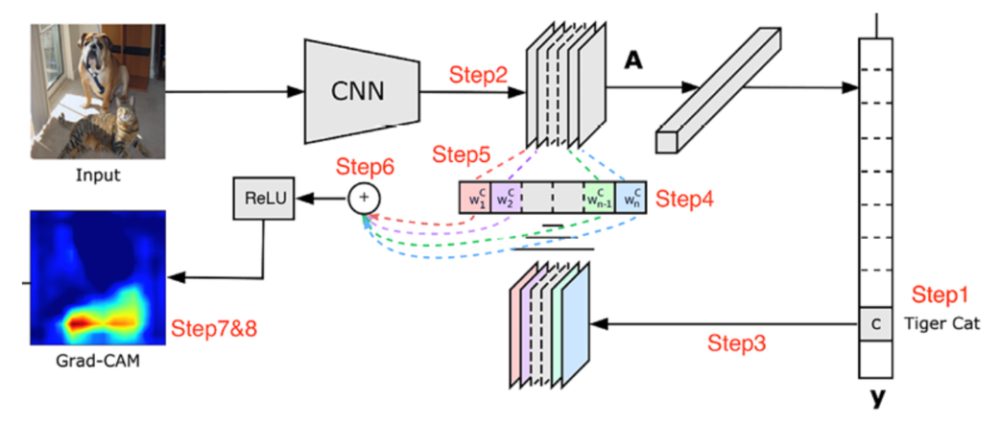
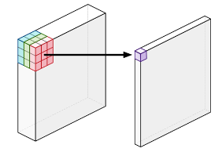
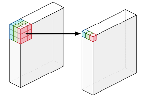
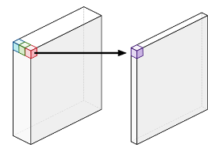
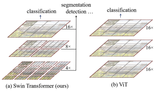
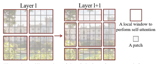

# Image Classification

## Concepts
### Class Activation Map (CAM)
*Grad-CAM: Visual Explanations from Deep Networks via Gradient-based Localization*

- If a certain pixel is important, then the CNN will have a large activation at those pixels
- If a certain convolutional channel is important with respect to the required class, the gradients at that channel will be very large

### Caveats
- Imbalanced data
  - confusion matrix
  - loss function (binary or categorical cross-entropy) ensures that the loss values are high when the amount of misclassification is high
  - higher class weights to rare class image
  - over-sample rare class image
  - data augmentation
  - transfer learning
- The size of the object (small) within an image
  - object detection: divide input image into smaller grid cells, then identify whether a grid cell contains the object of interest
  - model is trained and inferred on images with high resolution
- Data drift
- The number of nodes in the flatten layer
  - typically around 500-5000 nodes
- Image size
  - images of objects might not lose information if resized
  - images of text might lose considerable information

## Models
### MobileNet
- Designed for mobile devices
- Depthwise Separable Convolutions: achieves high accuracy while minimizng computational overhead
- Channel-wise Linear Bottleneck Layers: help to further reduce the number of parameters and computational cost while maintaining high accuracy

#### Depthwise Separable Convolutions
- Depthwise Convolution + Pointwise Convolution

1. **Standard convolution**

- Combines the values of all the input channels
- e.g. 3 channels --> 1 channel per pixel

2. **Depthwise convolution**

- Does not combine the input channels
- Convolves on each channel separately
- e.g. 3 channels --> 3 channels

3. **Pointwise convolution**

- Same as a standard convolution, except using a $1 \times 1$ kernel
- Adds up the channels from depthwise convolution as a weighted sum

#### Channel-wise Linear Bottleneck Layers
3 main operations applied sequentially:
1. **Depthwise convolution**: This step performs a convolution separately for each channel (a single color or feature) in the input image using a small filter (usually 3x3). The output of this step is the same size as the input but with fewer channels
2. **Batch normalization**: This operation normalizes the activation values across each channel, helping to stabilize the training process and improve generalization performance
3. **Activation function**: Typically, a ReLU (Rectified Linear Unit) activation function is used after batch normalization to introduce non-linearity in the network

#### Mobile-Former
*Mobile-Former: Bridging MobileNet and Transformer*
1. Use MobileNet as a feature extractor, then fed into a transformer model
2. Training MobileNet and ViT separately and then combining their predictions through ensemble techniques

### DenseNet

### EfficientNet

### ConvNext
- A significatnt improvement to pure convolution models by incorporating techniques inspired by ViTs and achieving results comparable to ViTs in accuracy and scalability
- TO-DO

### ViT
*An Image is Worth 16x16 Words: Transformers for Image Recognition at Scale*

- Inductive biases in CNNs, which are lacking in ViTs:
  1. **Translational Equivariance**: an object can appear anywhere in the image, and CNNs can detect its features
  2. **Locality**: pixels in an image interact mainly with its surrounding pixels to form features
- ViTs are highly scalable and trained on massive amount of images, overcoming the need of these inductive biases

### Swin Transformer
*Swin Transformer: Hierarchical Vision Transformer using Shifted Windows*

*Swin Transformer V2: Scaling Up Capacity and Resolution*

#### Shifted windows
- In the original ViT, attention is done between patch and all other patches, the processing time complexity increases quadratically with image dimensions
- Shifted window mechanism helps the model to extract features at variable scales and also restricts the computational complexity with respect to image size to linear
- Each window block is divided into patches and fed to model in same way the vision transformer processes the entire input image
- The self-attention block of the transformer computes the key-query weight for these patches within these windows
- This helps the model emphasize on small scale features, but since the relationship between the patches are computed within the windows self-attention mechanism, it's unable to capture the global context which is a key feature in transformers
- Window partitioning in successive layers:
  - In the first layer, the image is divided into windows by red boxes. Each window is further divided into patches denoted by gray boxes
  - In the second layer, this window is shifted, and these windows are overlapping with the windows divided in the previous layer

### Convolutional Vision Transformer (CvT)

### Dilated Neighborhood Attention Transformer (DiNAT)

### MobileViT v2