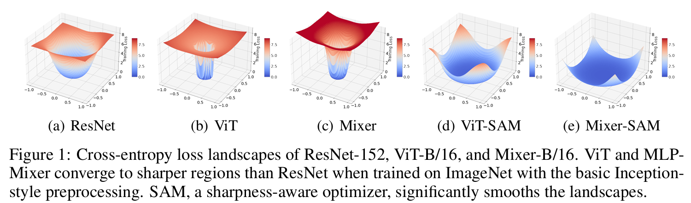

# Image Classification

## Concepts
### Class Activation Map (CAM)
*Grad-CAM: Visual Explanations from Deep Networks via Gradient-based Localization*

- If a certain pixel is important, then the CNN will have a large activation at those pixels
- If a certain convolutional channel is important with respect to the required class, the gradients at that channel will be very large

### Caveats
- Imbalanced data
  - confusion matrix
  - loss function (binary or categorical cross-entropy) ensures that the loss values are high when the amount of misclassification is high
  - higher class weights to rare class image
  - over-sample rare class image
  - data augmentation
  - transfer learning
- The size of the object (small) within an image
  - object detection: divide input image into smaller grid cells, then identify whether a grid cell contains the object of interest
  - model is trained and inferred on images with high resolution
- Data drift
- The number of nodes in the flatten layer
  - typically around 500-5000 nodes
- Image size
  - images of objects might not lose information if resized
  - images of text might lose considerable information

## Models
### MobileNet
- Designed for mobile devices
- Depthwise Separable Convolutions: achieves high accuracy while minimizng computational overhead
- Channel-wise Linear Bottleneck Layers: help to further reduce the number of parameters and computational cost while maintaining high accuracy

#### Depthwise Separable Convolutions
- Depthwise Convolution + Pointwise Convolution

1. **Standard convolution**

- Combines the values of all the input channels
- e.g. 3 channels --> 1 channel per pixel

2. **Depthwise convolution**

- Does not combine the input channels
- Convolves on each channel separately
- e.g. 3 channels --> 3 channels

3. **Pointwise convolution**

- Same as a standard convolution, except using a $1 \times 1$ kernel
- Adds up the channels from depthwise convolution as a weighted sum

#### Channel-wise Linear Bottleneck Layers
3 main operations applied sequentially:
1. **Depthwise convolution**: This step performs a convolution separately for each channel (a single color or feature) in the input image using a small filter (usually 3x3). The output of this step is the same size as the input but with fewer channels
2. **Batch normalization**: This operation normalizes the activation values across each channel, helping to stabilize the training process and improve generalization performance
3. **Activation function**: Typically, a ReLU (Rectified Linear Unit) activation function is used after batch normalization to introduce non-linearity in the network

#### Mobile-Former
*Mobile-Former: Bridging MobileNet and Transformer*
1. Use MobileNet as a feature extractor, then fed into a transformer model
2. Training MobileNet and ViT separately and then combining their predictions through ensemble techniques

### DenseNet

### SqueezeNet

### EfficientNet

### ConvNext
- A significatnt improvement to pure convolution models by incorporating techniques inspired by ViTs and achieving results comparable to ViTs in accuracy and scalability
- TO-DO

### ViT
*An Image is Worth 16x16 Words: Transformers for Image Recognition at Scale*

- Inductive biases in CNNs, which are lacking in ViTs:
  1. **Translational Equivariance**: an object can appear anywhere in the image, and CNNs can detect its features
  2. **Locality**: pixels in an image interact mainly with its surrounding pixels to form features
- ViTs are highly scalable and trained on massive amount of images, overcoming the need of these inductive biases

*How to train your ViT? Data, Augmentation, and Regularization in Vision Transformers*

- In comparison to CNNs, ViT's weaker inductive bias is generally found to cause an increased reliance on model regularization or data augmentation ("AugReg") when training on smaller training datasets
- Scaling datasets with AugReg and compute
- Transfer is the better option
- More data yields more generic models
- Prefer augmentation to regularization
- How to select a model for further adaption for an end application? One way is to run
 downstream adaptation for all available pre-trained models and then select the best performing model,
 based on the validation score on the downstream task of interest. This could be quite expensive in practice.
 Alternatively, one can select a single pre-trained model based on the upstream validation accuracy and then
 only use this model for adaptation, which is much cheaper
- Prefer increasing patch-size to shrinking the model size

*Scaling Vision Transformers*

- Scaling up compute, model and data together improves representation quality
- Representation quality can be bottlenecked by model size
- Large models benefit from additional data

| Name   | Width | Depth | MLP  | Heads | Mio. Param | GFLOPs (224²) | GFLOPs (384²) |
|--------|-------|-------|------|-------|------------|---------------|---------------|
| s/28   | 256   | 6     | 1024 | 8     | 5.4        | 0.7           | 2.0           |
| s/16   | 256   | 6     | 1024 | 8     | 5.0        | 2.2           | 7.8           |
| S/32   | 384   | 12    | 1536 | 6     | 22         | 2.3           | 6.9           |
| Ti/16  | 192   | 12    | 768  | 3     | 5.5        | 2.5           | 9.5           |
| B/32   | 768   | 12    | 3072 | 12    | 87         | 8.7           | 26.0          |
| S/16   | 384   | 12    | 1536 | 6     | 22         | 9.2           | 31.2          |
| B/28   | 768   | 12    | 3072 | 12    | 87         | 11.3          | 30.5          |
| B/16   | 768   | 12    | 3072 | 12    | 86         | 35.1          | 111.3         |
| L/16   | 1024  | 24    | 4096 | 16    | 303        | 122.9         | 382.8         |
| g/14   | 1408  | 40    | 6144 | 16    | 1011       | 533.1         | 1596.4        |
| G/14   | 1664  | 48    | 8192 | 16    | 1843       | 965.3         | 2859.9        |

*When Vision Transformers Outperform ResNets without Pre-training or Strong Data Augmentations*

- ViTs can outperform ResNets of even bigger sizes in both accuracy and various forms of robustness by using a principled optimizer, without the need for large-scale pre-training or strong data augmentations
- **Study from the lens of loss landscapes:**
  - Visualization and Hessian matrices of the loss landscapes reveal that Transformers and MLP-Mixers converge at extremely sharp local minima, whose largest principal curvatures are almost an order of magnitude bigger than ResNets'
  - Such effect accumulates when the gradiens backpropogate from the last layer to the first, and the intial embedding layer suffers the largest eigenvalue of the corresponding sub-diagonal Hessian
  - The networks all have very small training errors, and MLP-Mixers are more prone to overfitting than ViTs of more parameters (because of the difference in self-attention)
  - ViTs and MLP-Mixers have worse "trainabilities" than ResNets, following the neural tangent kernel analyses
- **Sharpness-aware minimizer (SAM):** explicitly smooths the loss geometry during model training
  - The first-order optmizers (e.g. SGD, Adam) only seek the model parameters that minimize the training error, which dismiss the higher-order information such as flatness that correlates with generalization
  - SAM strives to find a solution whose entire neighborhood has low losses rather than focus on any singleton point
  - SAM incurs another round of forward and backward propagations to update , which will lead to around 2x computational cost per update 

### MLP-Mixer
*MLP-Mixer: An all-MLP Architecture for Vision*

### Swin Transformer
*Swin Transformer: Hierarchical Vision Transformer using Shifted Windows*

*Swin Transformer V2: Scaling Up Capacity and Resolution*

#### Shifted windows
- In the original ViT, attention is done between patch and all other patches, the processing time complexity increases quadratically with image dimensions
- Shifted window mechanism helps the model to extract features at variable scales and also restricts the computational complexity with respect to image size to linear
- Each window block is divided into patches and fed to model in same way the vision transformer processes the entire input image
- The self-attention block of the transformer computes the key-query weight for these patches within these windows
- This helps the model emphasize on small scale features, but since the relationship between the patches are computed within the windows self-attention mechanism, it's unable to capture the global context which is a key feature in transformers
- Window partitioning in successive layers:
  - In the first layer, the image is divided into windows by red boxes. Each window is further divided into patches denoted by gray boxes
  - In the second layer, this window is shifted, and these windows are overlapping with the windows divided in the previous layer

### Convolutional Vision Transformer (CvT)

### Dilated Neighborhood Attention Transformer (DiNAT)

### MobileViT v2