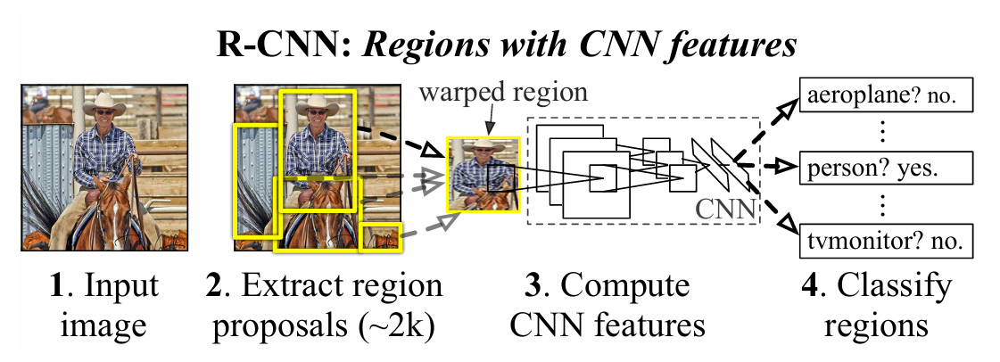
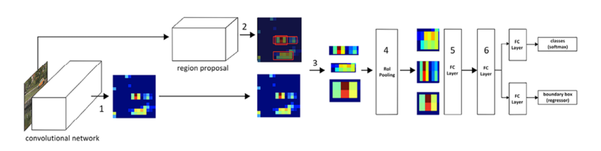

# Object Detection

## Workflow (Few-shot)
1. Creating ground-truth data that contains labels of the bounding box and class corresponding to various objects present in the image
2. Coming up with mechanisms that scan through the image to identify regions (region proposals) that are likely to contain objects
3. Creating the target class variable by using the IoU metric
4. Creating the target bounding-box offset variable to make corrections to the location of the region proposal in step 2
5. Building a model that can predict the class of object along with the target bounding-box offset corresponding to the region proposal
6. Measuring the accuracy of object detection using mean average precision (mAP)

## Models
### R-CNN: Regions with CNN features
*Rich feature hierarchies for accurate object detection and semantic segmentation*

**Workflow**:
1. Extract region proposals with selective search from an image. We need to ensure that we extract a high number of proposals to not miss out on any potential object within the image.
2. Resize (warp) all the extracted regions to get regions of the same size.
3. Pass the resized region proposals through a network. Typically, we pass the resized region proposals through a pretrained model, such as VGG16 or ResNet50, and extract the features in a fully connected layer.
4. Create data for model training, where the input is features extracted by passing the region proposals through a pretrained model. The outputs are the class corresponding to each region proposal and the offset of the region proposal from the ground truth corresponding to the image.
  - If a region proposal has an IoU greater than a specific threshold with the object, we create training data.
  - We calculate the offset between the region proposal bounding box and the ground-truth bounding box as the differencebetween the center coordinates of the two bounding boxes `(dx, dy)`, and the difference between the height and width of the bounding boxes `(dw, dh)`
5. Connect two output heads, one corresponding to the class of image and the other corresponding to the offset of region proposal with the ground-truth bounding box, to extract the fine bounding box on the object
6. Train the model after writing a custom loss function that minimizes both the object classification error and the bounding-box offset error

**Caveats**:
- The feature vector generated by the CNN, is consumed by a binary SVM trained for each class independently

### Fast R-CNN
*Fast R-CNN*

**Workflow**:
1. Pass the image through a pretrained model to extract features prior to the flatenning layer
2. Extract region proposals corresponding to the image
3. Extract the feature map area corresponding to the region proposals
4. Pass the feature maps corresponding to region proposals through the region of interest (RoI) pooling layer one at a time
  - thus all feature maps of region proposals have a similar shape
5. Pass the RoI pooling output value through a fully connected layer
6. Train the model to predict class and offsets corresponding to each region proposal

## Concepts
### Felzenszwalb's algorithm
*Efficient Graph-Based Image Segmentation*
- segmentation based on the color, texture, size, and shape compatibility of content within an
image

### Selective Search
*Selective Search for Object Recognition*
- region proposal algorithm
- generate proposals of regions that are likely to be grouped together based on their pixel intensities
- group pixels based on the hierarchical grouping of similar pixels (leverages the color, texture, size, and shape compatibility of content within an image)
- **Workflow**:
  1. over-segments an image by grouping pixels based on the preceding attributes
  2. iterates through these over-segmented groups and groups them based on similarity
    - at each iteration, it combines smaller regions to form a larger region

### Non-max suppression
- **non-max**: boxes that don't have the highest probability of containing an object
- **suppresion**: discarding those boxes
- **Workflow**:
  1. identify the bounding box that has the highest probability of containing the object
  2. discard all the other bounding boxes that have an IoU below a certain threshold with the box (highest probability containing an object)

### Mean average precision
- **Precision**: $Precision = \frac{TP}{TP + FP}$
  - **True positive**: bounding boxes that predicted the correct class of object and have an IoU with a ground truth that is greater than a certain threshold
  - **False positive**: bounding boxes that predicted the class incorrectly or have an overlap that is less than the defined threshold with the ground truth
  - If there are multiple bounding boxes that are identified for the same ground-truth bounding box, only one box can be a true positive, and everything else is a false positive
- **Average precision**: average of precision values calculated at various IoU thresholds
- **mAP**: average of precision values calculated at various IoU threshold values across all the classes of objects

### RoI Pooling
- ensures fixed-size output for varying RoI dimensions

## References
- https://lilianweng.github.io/posts/2017-10-29-object-recognition-part-1/
- https://lilianweng.github.io/posts/2017-12-15-object-recognition-part-2/
- https://lilianweng.github.io/posts/2017-12-31-object-recognition-part-3/
- https://lilianweng.github.io/posts/2018-12-27-object-recognition-part-4/